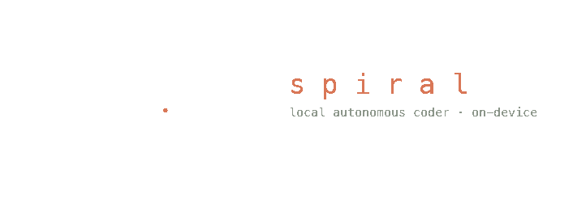

<p align="center">
  
</p>

<p align="center">
  <b>Local-first autonomous coding CLI.</b><br/>
  Give it a goal — it plans, designs, builds, verifies, and validates against a spec,
  entirely on your own hardware. No API keys. No cloud. No babysitting.
</p>

---

## Install

```bash
pip install spiral-coder          # or: pip install -e . from a clone
```

Requires Python 3.11+, [Ollama](https://ollama.com), and at least one capable
local model (32 GB unified memory recommended).

## Use

```bash
spiral tune                   # once per machine: calibrate context windows (KV math + advisor)
spiral build "make me a pomodoro TUI in python with tests"
spiral build                  # re-run: reuses the stored goal, resumes where it left off
spiral validate               # judge the current code against the goal's spec (read-only)
spiral plan "…"               # see the decomposition without executing
spiral research "query"       # GET-only web search + page reading
```

## What a run actually does

```
spec extraction ─→ design brief ─→ plan ─→ critic review ─→ repair
      │                                        (a different model judges the plan)
      ▼
bootstrap the build gate to green          (error-set ratchet: progress is banked, never lost)
      ▼
grind tasks green-to-green                 (skills in-prompt · attempt memory · symbol hunter
      │                                     · escalation lane · auto-distilled fixes)
      ▼
clean-build hygiene ─→ chunked spec validation ─→ remediation ─→ SPEC-GREEN
```

Every green task is a commit on a `spiral/run-*` branch — your branch is never
touched. Every attempt is a row in `.spiral/ledger.jsonl`; planner reasoning is
captured to disk; every escalation win becomes a reusable skill for the next run.

```
╭──────────── ⠷ plan ─────────────╮
│  ✓ M0 make the build gate pass  │
│  ◆ M1 Login screen  2/3         │
│    ✓ 1.1 Create LoginActivity   │
│    ▶ 1.2 Wire registration      │
│    ○ 1.3 Update manifest        │
│  3/7 green · 0 blocked · 14m    │
╰─────────────────────────────────╯
 ⠹ spiral · building [worker] · 48.2k tok · 12s
    ✎ app/src/main/java/LoginActivity.kt
```

## Swappable models

Every role is a plug — set once, or per-run:

```bash
export SPIRAL_WORKER=qwen3.6:latest       # fast MoE: plans & builds
export SPIRAL_ESCALATION=qwen3.6:27b      # dense: takes over stuck tasks
export SPIRAL_CRITIC=qwen3.6:27b          # different brain: reviews plans, validates specs
export SPIRAL_JANITOR=llama3.2:1b         # tiny: compacts attempt history
export SPIRAL_BASE_URL=http://localhost:11434
```

or persistently in `~/.config/spiral/config.json`:

```json
{
  "models":  { "worker": "qwen3.6:latest", "critic": "qwen3.6:27b" },
  "hooks":   { "run_complete": "osascript -e 'display notification \"$SPIRAL_INFO\" with title \"spiral\"'" }
}
```

## The ideas inside

- **Never trust the model's opinion of done.** The build gate, artifact checks,
  behavior audits, and a spec validator form a tower of verification — each layer
  catches the lie the previous one can't see.
- **Progress is banked.** Bootstrap repairs commit checkpoints per resolved error;
  a failed marathon resumes where it stopped, across runs.
- **Taste is specification.** A design brief (palette tokens, type scale, motion
  timings, verbatim microcopy) rides every prompt — the executor implements
  decisions, not vibes.
- **The expensive model teaches the cheap one.** Escalation wins are distilled
  into per-repo skills the fast lane reads next time.

See [DESIGN.md](DESIGN.md) for the architecture and the hard-won invariants.

## Extras

```bash
python -m spiral.banner --vortex        # you'll see
python experiments/sinks_test.py        # what survives context overflow?
```

---

<p align="center">
Built by <b>Edis Devin Tireli</b> · Ph.D. Fellow, University of Copenhagen
</p>
